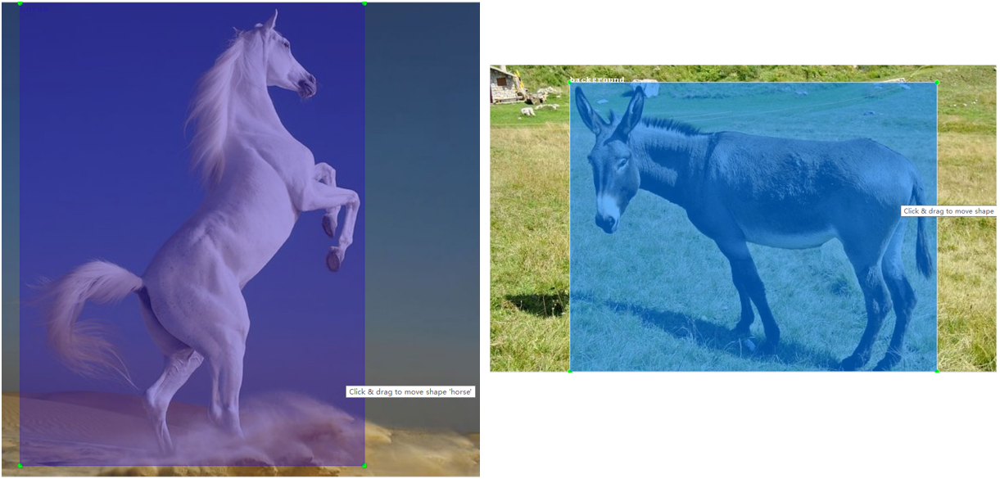
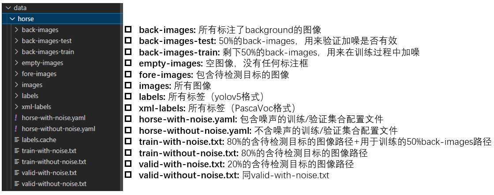
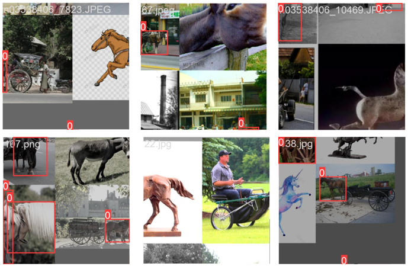
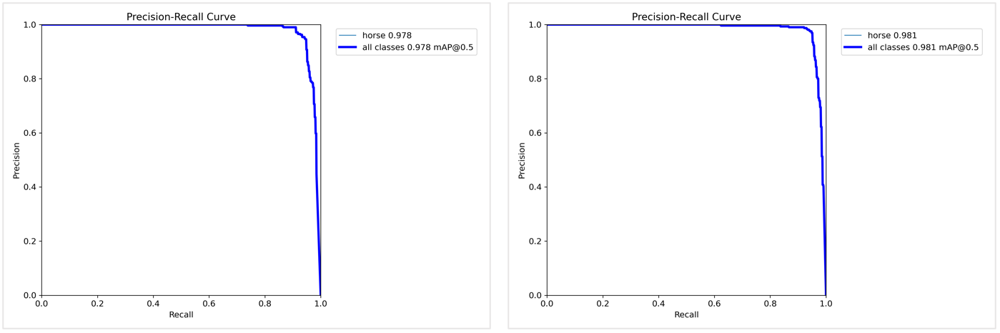
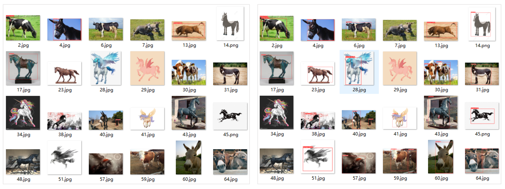

# 减少目标检测误检——加噪

## 为什么需要加噪？

目标检测是深度学习中发展比较成熟的领域，得益于不断刷新SOTA的各大检测框架，以及如HSV变换、仿射变换和图像拼接等各式各样的图像增强，目标检测模型的拟合和泛化能力十分强悍。但是，现在的目标检测模型泛化能力是有局限的，造成这个局限的原因就是现有的目标检测框架都只能训练带有目标的图像。当一张图像中没有目标时，是不会纳入损失函数的计算，也就不会对模型产生作用。然而，一张没有目标的图像，同样也能是有意义的。

现在假设你是个懂AI的牧马场场主，你想做个基于目标检测模型的马匹自动计数器。于是吭哧吭哧搞了很多马匹的图像，训练好模型，在使用的时候，发现牛、羊、狗、小孩的玩具马、屏幕上的卡通马、路过的驴、骆驼、天上下凡的独角兽等等杂七杂八的东西都被检测成了马。为什么？因为你的数据里面只有马。如果你的数据里面有一些马和牛恰好在一起的图像，那么牛的误检就会有所减少。为什么？因为这头牛恰好被加入了训练。但是，仅靠“恰好”和目标在一张图像，被动的加入训练是远远不够的，你需要主动把可能被误识别的噪声也加入训练，这也就是加噪的必要性。

## 加噪的方法

我认为根据数据量的多少，有两种加噪的方法：

- 当某一类噪声数据量比较多的时候，将该类噪声标注为新一类。还是前面的例子，假设你标注了千余张含马的图像，其中有一些包含牛，还有一些只有牛没有马的图像，合起来含牛的也有个几百张了，那么就可以把牛也标注成为新的类别进行训练。
- 当某一类噪声数据量比较少的时候，通过图像拼接将含目标的图像和含噪声的图像拼接成一张图像。假设你标注的含马图像中，只有几张包含驴，还有一些只有驴没有马的图像，可以想办法把它们拼接起来，那么在训练马的同时，也能告诉模型别检测这些驴了。

## YOLOv8魔改实践

实践是检验真理的唯一标准。前述的第一种加噪方法自不必说，肯定可以减少误识别；而第二种方法仍需验证，于是我基于YOLOv8框架进行了魔改实践。

### 数据标注

首先是数据标注规则：

- 对需要检测的目标对象，按照原定的类别进行标注
- 对不包含目标对象，但包含可能造成目标对象误识别的噪声图像，标注一个**background**类的框（框的尺寸和位置均可随机）

下面是一个标注示例，左图包含需检测的目标对象（马），右图是不包含目标对象（马），但包含可能造成目标对象误识别的噪声（驴）图像：

然后是类别转换。除了将**background**类的类别索引改为**-1**，其余需要检测的类别和框均按照正常的yolov8所需的txt格式进行转换。

### 数据分组

按照yolov8的数据格式，我准备了如下数据：

其中有1309张包含马的图像（fore-images）；194张可能被误识别为马的噪声图像，其中97张用来在训练过程中加入噪声（back-images-train），97张用来测试（back-images-valid）。作为对照，我准备了不加噪声的组别进行训练。

### 魔改代码

代码实现的中心思想是：将类别为**-1**的噪声加入到图像拼接中，使其能真正进入训练，但在计算loss前需要将**-1**类删除，使其不影响正常待检目标的训练。我的代码放在了：

[Accustomer/ultralytics-with-noise: Add noise for object detection. (github.com)](https://github.com/Accustomer/ultralytics-with-noise)

其中**ModificationRecord.md**文件详细记录了我的修改记录。这里展示一下加噪后的拼接图像：

### 正常待检目标检测对比

加噪的首要条件是不影响正常待检目标的训练，这里对比下加噪与不加噪在同一个验证集上的PR_curve：

其中左图是加噪模型在验证集上的测试结果，右图是未加噪模型在验证集上的测试结果。可以看出加噪前后正常待检目标的检测准确率变化很小，可能是随机误差造成的细微差异，加噪本身对正常待检目标并无影响。

### 可能误检的噪声检测对比

那么加噪后对可能误检的噪声影响如何，误检率是否会下降？这里对比下噪声的误检率：

|      数据集       | 加噪模型误检数量 | 正常模型误检数量 |
| :---------------: | :--------------: | :--------------: |
| back-images-train |        0         |       104        |
| back-images-test  |        21        |       104        |

可以看出误检率显著下降。最后再展示一些直观的误检图像对比：

左图是加噪模型在back-images-test上的表现，右图是正常训练的模型的表现。可以直观的看出误检率显著下降。

